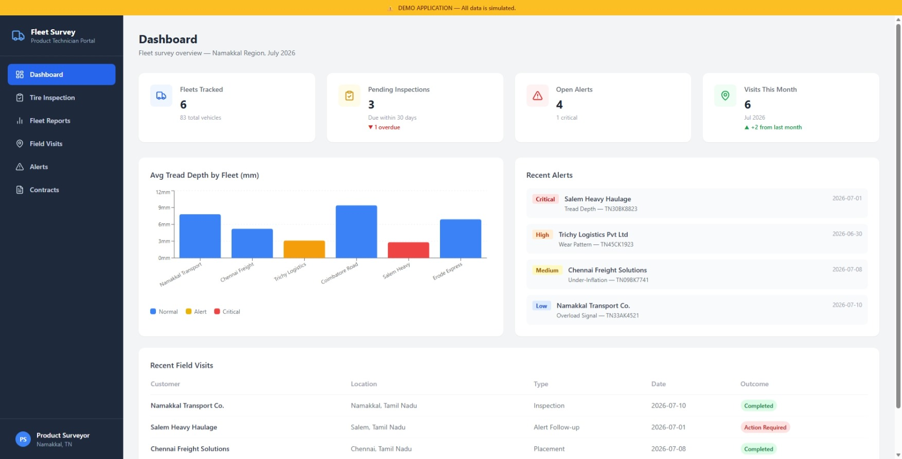
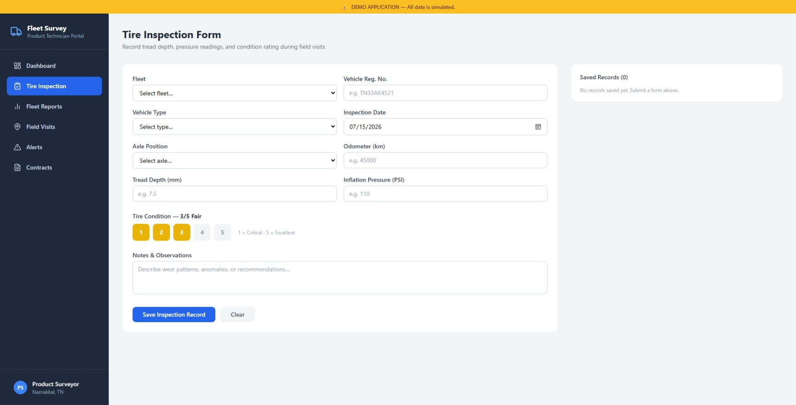
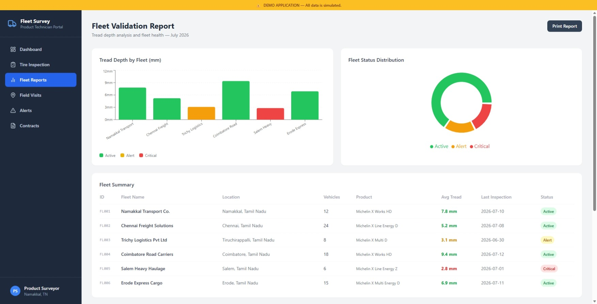
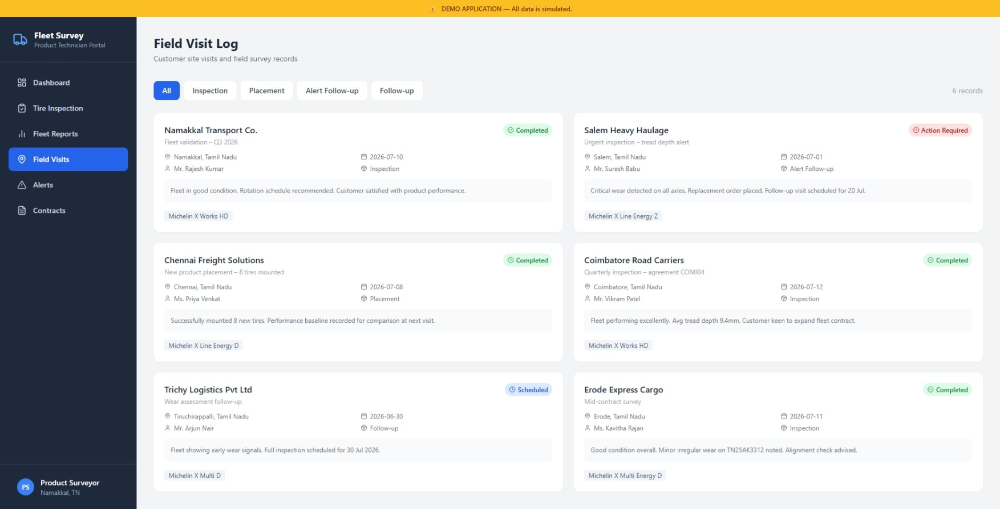
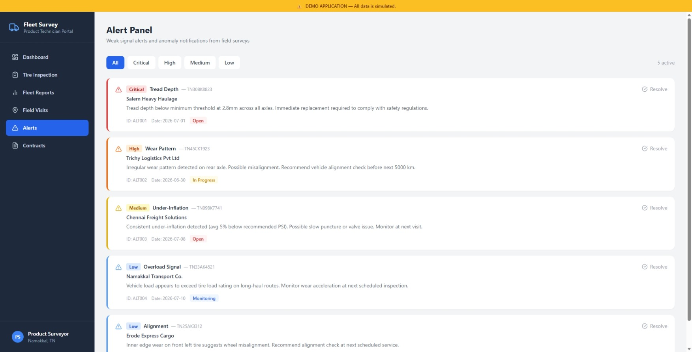
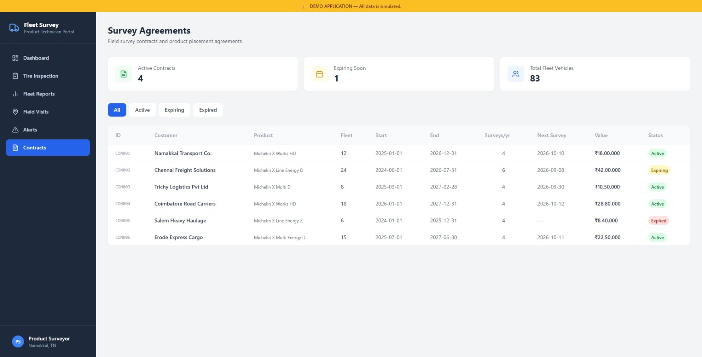

# Fleet Survey Dashboard

> **Demo application** that helps the **Product Survey Technician** in commercial tire and fleet management to record and track their work.

---

## Screenshots

### Dashboard — KPI Overview & Tread Depth Analysis


### Tire Inspection Form — Field Data Entry


### Fleet Validation Report — Charts & Inspection Log


### Field Visit Log — Customer Site Records


### Alert Panel — Weak Signal Notifications


### Survey Agreements — Contract Management


---

## What this application simulates

This dashboard mirrors the day-to-day deliverables of a Product Survey Technician:

| Role Deliverable | App Feature |
|---|---|
| Fleet validation reports | Fleet Report page with tread depth charts |
| Tire / vehicle inspection data | Inspection Form with measurements, photos placeholder, condition rating |
| Weak signal alert reports | Alert Panel with Critical / High / Medium / Low severity |
| Field / customer visit records | Field Visit Log with outcome tracking |
| Agreement / field survey contracts | Survey Agreements page with status management |
| Mounting reports | Fleet Report inspection log with axle-by-axle data |

All mock data is set in the Tamil Nadu region context.

---

## Run locally

```bash
npm install
npm run dev
```
